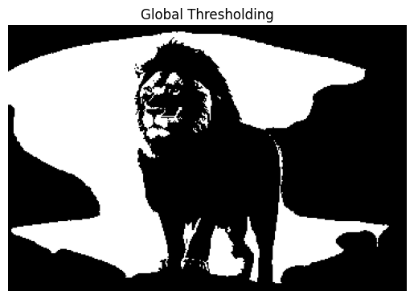
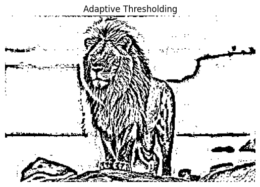
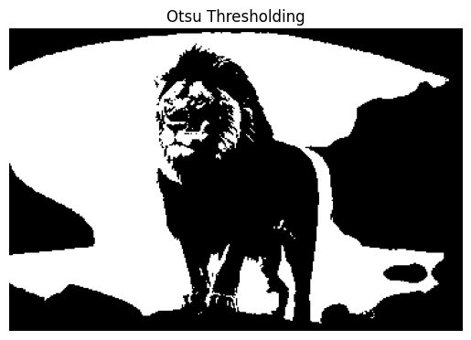

# THRESHOLDING
## Aim:
To segment the image using global thresholding, adaptive thresholding and Otsu's thresholding using python and OpenCV.

## Software Required:
1. Anaconda - Python 3.7
2. OpenCV

## Algorithm:

### Step1:
Load the necessary packages.

### Step2:
Read the Image and convert to grayscale.

### Step3:
Use Global thresholding to segment the image.

### Step4:
Use Adaptive thresholding to segment the image.

### Step5:
Use Otsu's method to segment the image and display the results.

## Program:

```python
import cv2
import numpy as np
import matplotlib.pyplot as plt

image = cv2.imread("LION.jpg") 
gray_image = cv2.cvtColor(image, cv2.COLOR_BGR2GRAY)  

plt.imshow(cv2.cvtColor(image, cv2.COLOR_BGR2RGB))  
plt.title("Original Image")
plt.axis('off')
plt.show()

def display_img(img):
    plt.imshow(img,cmap='gray')
    plt.axis('off')
    plt.show()

# Global Thresholding

_, global_thresholded = cv2.threshold(gray_image, 127, 255, cv2.THRESH_BINARY)
plt.title("Global Thresholding")
display_img(global_thresholded)

# Adaptive Thresholding

adaptive_thresholded = cv2.adaptiveThreshold(gray_image, 255, cv2.ADAPTIVE_THRESH_GAUSSIAN_C, cv2.THRESH_BINARY, 11, 2)
plt.title("Adaptive Thresholding")
display_img(adaptive_thresholded)


# Otsu's Method


_, otsu_thresholded = cv2.threshold(gray_image, 0, 255, cv2.THRESH_BINARY + cv2.THRESH_OTSU)
plt.title("Otsu Thresholding")
display_img(otsu_thresholded)
```

## OUTPUT

### Original Image


### Global Thresholding


### Adaptive Thresholding


### Otsu's Method


## Result:
Thus the images are segmented using global thresholding, adaptive thresholding and optimum global thresholding using python and OpenCV.